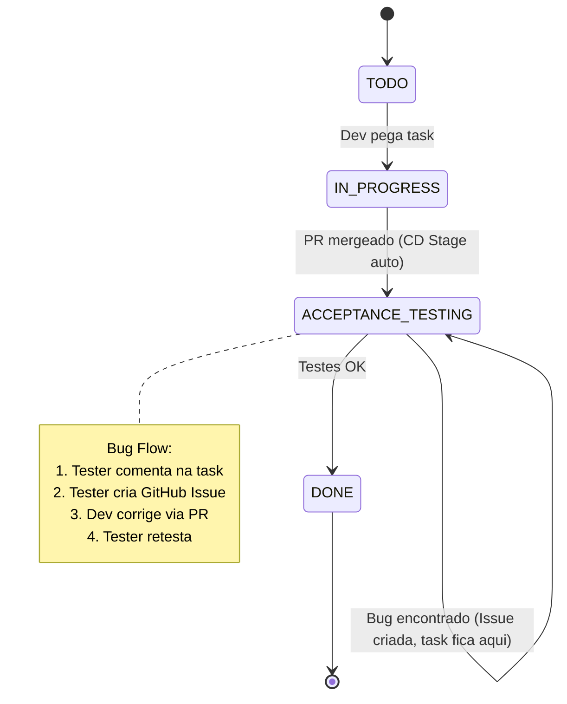

# GitFlow - BTC Grid Bot

**Data:** 27 de Dezembro de 2025
**Versao:** 1.8

---

## Sumario

1. [Visao Geral](#visao-geral)
2. [GitHub Projects](#github-projects)
3. [Ambientes](#ambientes)
3. [Diagrama do Fluxo](#diagrama-do-fluxo)
4. [Estados das Tasks](#estados-das-tasks)
5. [Fluxo Detalhado](#fluxo-detalhado)
6. [Fluxo de Deploy](#fluxo-de-deploy)
7. [Processo de Bugfix](#processo-de-bugfix)
8. [Convencoes de Nomenclatura](#convencoes-de-nomenclatura)
9. [Responsabilidades](#responsabilidades)
10. [Checklists por Etapa](#checklists-por-etapa)
11. [Templates de PR](#templates-de-pr)
12. [Criterios de Aprovacao](#criterios-de-aprovacao)
13. [Resolucao de Conflitos](#resolucao-de-conflitos)
14. [Rollback](#rollback)

---

## Visao Geral

Este documento define o fluxo de trabalho GitFlow para o projeto BTC Grid Bot. O fluxo e baseado em:

- **Branch principal:** `main` (codigo de producao)
- **PRs diretos para main:** Features, bugfixes e hotfixes
- **Dois ambientes:** Stage (demo) e Production (live)
- **Deploy automatico para Stage:** Via CD Stage + Watchtower
- **Deploy manual para Production:** Via CD Prod + Watchtower

---

## GitHub Projects

> **Board Principal:** https://github.com/users/diogolacerda/projects/2

O GitHub Projects e a **fonte da verdade** para o status das tasks. Todos os agentes devem:

### Ao Pegar uma Task

1. **Ler a descricao no GitHub Projects** - A descricao completa da task (criterios de aceite, arquivos a modificar, etc) esta no body do item
2. **Atualizar status para "In Progress"** no GitHub Projects
3. Seguir os criterios de aceite definidos na descricao

### Ao Concluir uma Task

1. **Atualizar status para "Done"** no GitHub Projects (ou status apropriado)

> **Nota:** Os arquivos `.md` em `/tasks/` servem apenas como **fonte de importacao** para o GitHub Projects.
> Nao e mais necessario atualiza-los manualmente. O GitHub Projects e a unica fonte de verdade.

### Comandos Uteis

```bash
# Listar tasks do projeto
gh project item-list 2 --owner diogolacerda --limit 100

# Ver detalhes de uma task (obter Draft ID primeiro)
gh api graphql -f query='
query {
  node(id: "PVT_kwHOABvENc4BLYiG") {
    ... on ProjectV2 {
      items(first: 100) {
        nodes {
          content {
            ... on DraftIssue {
              id
              title
              body
            }
          }
        }
      }
    }
  }
}'

# Atualizar status de uma task
# Status IDs: Todo=69ea4564, In Progress=1609e48b, Acceptance Testing=d9f2871e, Done=fab1b20b
gh project item-edit --project-id PVT_kwHOABvENc4BLYiG --id <ITEM_ID> \
  --field-id PVTSSF_lAHOABvENc4BLYiGzg6-Uo8 --single-select-option-id <STATUS_ID>
```

### Campos do Projeto

| Campo | ID | Opcoes |
|-------|-----|--------|
| Status | `PVTSSF_lAHOABvENc4BLYiGzg6-Uo8` | Todo (`69ea4564`), **In Progress** (`1609e48b`), Acceptance Testing (`d9f2871e`), Done (`fab1b20b`) |
| Area | `PVTSSF_lAHOABvENc4BLYiGzg6-UrM` | DevOps, Backend, Database, Frontend, Docs |
| Sprint | `PVTSSF_lAHOABvENc4BLYiGzg6-Usg` | Sprint 0-3, Backlog |
| Priority | `PVTSSF_lAHOABvENc4BLYiGzg6-Usk` | Critical, High, Medium, Low |

---

## Ambientes

### Stage
- **Imagem:** `btcbot:stage`
- **Porta:** 3001
- **TRADING_MODE:** `demo` (sempre!)
- **Banco:** postgres-stage (separado)
- **Deploy:** Automatico apos merge em main
- **Proposito:** Testes de aceitacao antes de ir para producao

### Production
- **Imagem:** `btcbot:latest`
- **Porta:** 3000
- **TRADING_MODE:** `live`
- **Banco:** postgres-prod (separado)
- **Deploy:** Manual via workflow_dispatch
- **Proposito:** Ambiente real de trading

---

## Diagrama do Fluxo

### Fluxo Completo (ASCII)

```
+------------------+
|       TODO       |
+--------+---------+
         |
         | Dev pega task
         v
+------------------+
|   IN_PROGRESS    |
|                  |
|  - Cria branch   |
|  - Desenvolve    |
|  - Push PR       |
+--------+---------+
         |
         | Finaliza desenvolvimento, merge direto para main
         | CD Stage automatico -> btcbot:stage
         v
+------------------+
|ACCEPTANCE_TESTING|
|                  |
|  - Testes Stage  |
|  - Validacao     |
|  - port 3001     |
+--------+---------+
         |
         +------------------+
         |                  |
         | Bug?             | Sem bugs
         v                  v
+------------------+  +------------------+
| Task fica em     |  |       DONE       |
| ACCEPTANCE_TESTING|  +------------------+
|                  |
| Tester:          |
| 1. Comenta task  |
| 2. Cria Issue    |
+--------+---------+
         |
         | Dev corrige
         | (branch do Issue)
         v
+------------------+
| PR merged        |
| CD Stage auto    |
+--------+---------+
         |
         | Tester retesta
         v
   OK? ------> DONE
```

### Fluxo em Mermaid



### Fluxo de Branches

```
main ─────────────────────────────────────────────────────────────>
    \                                      /           \           /
     \  feature/BE-001-trade-repository   /             \ bugfix  /
      \_________________________________ /               \_______ /
                   PR Merge                                    PR Merge
                        |                                     |
                        v                                     v
                   CD Stage auto                         CD Stage auto
                   btcbot:stage                          btcbot:stage
```

### Fluxo de Deploy

```
                    +------------------+
                    |   PR Merged      |
                    |   to main        |
                    +--------+---------+
                             |
                             v
                    +------------------+
                    | CD Stage (auto)  |
                    | Build + Push     |
                    | btcbot:stage     |
                    +--------+---------+
                             |
                             v
                    +------------------+
                    | Watchtower Stage |
                    | Auto-update      |
                    | port 3001        |
                    +--------+---------+
                             |
                             v
                    +------------------+
                    | Acceptance Test  |
                    | em Stage         |
                    +--------+---------+
                             |
              +--------------+--------------+
              |                             |
              v                             v
     +------------------+          +------------------+
     | OK - DONE        |          | Bug Encontrado   |
     +------------------+          +--------+---------+
                                            |
                                            v
                                   +------------------+
                                   | Tester comenta   |
                                   | e/ou cria Issue  |
                                   +--------+---------+
                                            |
                                            v
                                   +------------------+
                                   | Dev corrige (PR) |
                                   +--------+---------+
                                            |
                                            v
                                   Volta para Acceptance
```

---

## Estados das Tasks

### Definicao dos Estados

| Estado | Descricao | Responsavel | Ambiente |
|--------|-----------|-------------|----------|
| `TODO` | Task disponivel para ser iniciada | - | - |
| `IN_PROGRESS` | Desenvolvimento em andamento | Dev | Local |
| `ACCEPTANCE_TESTING` | Em testes no ambiente Stage (inclui correcao de bugs) | Tester/Dev | Stage (:3001) |
| `DONE` | Concluido e validado em Stage | - | Stage (:3001) |

### Estado ACCEPTANCE_TESTING

Este estado cobre todo o ciclo de testes, incluindo correcoes de bugs:

**Task entra em ACCEPTANCE_TESTING quando:**
- PR foi mergeado em main
- CD Stage fez deploy automatico da nova imagem

**Task permanece em ACCEPTANCE_TESTING enquanto:**
- Tester esta validando a funcionalidade
- Bugs estao sendo corrigidos (Issues criadas, mas task nao muda de status)
- Dev esta trabalhando em correcoes

**Task sai de ACCEPTANCE_TESTING para DONE quando:**
- Todos os criterios de aceite foram validados
- Nenhum bug pendente

### Transicoes Permitidas

```
TODO ──────────────> IN_PROGRESS (Dev pega task)
IN_PROGRESS ───────> ACCEPTANCE_TESTING (PR mergeado -> CD Stage)
ACCEPTANCE_TESTING ─> DONE (testes OK, sem bugs pendentes)
```

### Transicoes NAO Permitidas

- `DONE` -> qualquer estado (task finalizada)
- Pular estados (ex: IN_PROGRESS -> DONE)

---

## Fluxo Detalhado

> **IMPORTANTE - GitHub Projects e a Fonte da Verdade:**
> O agente/dev que **pega a task** e responsavel por:
> 1. **Ler a descricao da task no GitHub Projects** (criterios de aceite, arquivos, etc)
> 2. **Atualizar o status no GitHub Projects** em todas as transicoes
>
> Os arquivos `.md` em `/tasks/` NAO devem mais ser atualizados. Servem apenas para importacao inicial.

### 1. Inicio do Desenvolvimento

**Acoes:**
1. Dev/Agente seleciona uma task em `TODO` no GitHub Projects
2. **OBRIGATORIO:** Le a descricao completa da task no GitHub Projects:
   ```bash
   # Buscar descricao da task (exemplo para BE-021)
   gh api graphql -f query='
   query {
     node(id: "PVT_kwHOABvENc4BLYiG") {
       ... on ProjectV2 {
         items(first: 100) {
           nodes {
             content {
               ... on DraftIssue {
                 title
                 body
               }
             }
           }
         }
       }
     }
   }' | grep -A 100 "BE-021"
   ```
3. **OBRIGATORIO:** Atualiza status para `In Progress` no GitHub Projects:
   ```bash
   gh project item-edit --project-id PVT_kwHOABvENc4BLYiG --id <ITEM_ID> \
     --field-id PVTSSF_lAHOABvENc4BLYiGzg6-Uo8 --single-select-option-id 1609e48b
   ```
4. Cria branch a partir de `main`:
   ```bash
   git checkout main
   git pull origin main
   git checkout -b feature/BE-001-implementar-trade-repository
   ```
5. Inicia o desenvolvimento seguindo os **criterios de aceite** da descricao

**Regras:**
- Cada dev/agente deve ter no maximo 1 task em `In Progress`
- Branch deve seguir a convencao de nomenclatura
- Commits devem ser atomicos e descritivos
- **Seguir os criterios de aceite definidos na descricao do GitHub Projects**

### 2. Desenvolvimento Concluido e Merge

**Acoes:**
1. Dev/Agente finaliza a implementacao (seguindo criterios de aceite do GitHub Projects)
2. Garante que todos os testes passam localmente:
   ```bash
   pytest
   ruff check .
   mypy .
   ```
3. Faz push da branch:
   ```bash
   git push origin feature/BE-001-implementar-trade-repository
   ```
4. Abre PR para `main` usando o template apropriado
5. Verifica que todos os checks de CI passaram
6. Faz merge do PR para `main`
7. **OBRIGATORIO:** Atualiza status no GitHub Projects (CD Stage e automatico apos merge)

**Regras:**
- PR deve ter descricao clara do que foi feito
- Todos os checks de CI devem passar antes do merge
- PR deve referenciar a task (ex: `Closes #123` ou `Ref: BE-001`)
- **O mesmo agente que iniciou a task atualiza o status no GitHub Projects**
- Merge pode ser feito diretamente apos CI passar

### 3. Deploy para Stage

**Acoes:**
1. **CD Stage e acionado automaticamente apos merge:**
   - Build da imagem Docker
   - Push para registry com tag `btcbot:stage`
2. **Watchtower detecta nova imagem** (poll 30s)
3. **Container btcbot-stage e atualizado automaticamente**
4. Task ja esta em `ACCEPTANCE_TESTING` (atualizado no passo anterior)

**Regras:**
- Usar "Merge commit" (nao squash ou rebase)
- Deletar branch apos merge
- Verificar se CD Stage completou com sucesso
- Verificar se Watchtower atualizou o container

### 4. Acceptance Testing

**Acoes do Tester:**
1. Acessa ambiente Stage (porta 3001)
2. Usa descricao da task no GitHub Projects para saber o que testar
3. Executa testes manuais e/ou automatizados
4. Documenta resultados

**Se bugs forem encontrados:**

A task **permanece em ACCEPTANCE_TESTING** enquanto bugs sao corrigidos.

1. **Comentar na task** (rapido): Adiciona comentario descrevendo o bug
2. **Criar GitHub Issue** (detalhado): Para bugs criticos ou complexos
   - Titulo: `[BUG] <descricao curta>`
   - Usar template de bug (ver secao Processo de Bugfix)
   - Referenciar a task original
   - Adicionar Issue ao GitHub Projects manualmente
3. Dev cria branch a partir da Issue: `bugfix/<issue-number>-<descricao>`
4. Dev corrige e abre PR com `Fixes #<issue-number>` no corpo (fecha Issue automaticamente no merge)
5. Apos merge, CD Stage faz deploy automatico
6. Tester retesta a task original
7. Se OK: move task para `DONE` (Issues ja foram fechadas pelo PR)

**Se nenhum bug for encontrado:**
1. Tester move task para `DONE`

**Regras:**
- Task **nunca** muda de status por causa de bugs (fica em ACCEPTANCE_TESTING)
- Todos os criterios de aceite devem ser verificados antes de mover para DONE
- Bugs sao rastreados via GitHub Issues, nao via mudanca de status

---

## Fluxo de Deploy

### Stage (Automatico)

```
PR merged to main
       |
       v
+------------------+
| GitHub Actions   |
| cd-stage.yml     |
+--------+---------+
         |
         | Build + Push
         v
+------------------+
| Docker Registry  |
| btcbot:stage     |
+--------+---------+
         |
         | Poll 30s
         v
+------------------+
| Watchtower       |
| Auto-update      |
+--------+---------+
         |
         v
+------------------+
| btcbot-stage     |
| port 3001        |
| TRADING=demo     |
+------------------+
```

### Production (Manual)

```
Tester aprova em Stage
       |
       v
+------------------+
| GitHub Actions   |
| cd-prod.yml      |
| (manual trigger) |
+--------+---------+
         |
         | Retag stage -> latest
         v
+------------------+
| Docker Registry  |
| btcbot:latest    |
+--------+---------+
         |
         | Poll 30s
         v
+------------------+
| Watchtower       |
| Auto-update      |
+--------+---------+
         |
         v
+------------------+
| btcbot-prod      |
| port 3000        |
| TRADING=live     |
+------------------+
```

---

## Processo de Bugfix

### Quando o Tester Encontra um Bug

O fluxo de bugs e **simples**: a task original permanece em ACCEPTANCE_TESTING e bugs sao rastreados via GitHub Issues.

1. **Reportar o Bug:**
   - **Rapido:** Comentar na task do GitHub Projects descrevendo o bug
   - **Detalhado:** Criar GitHub Issue para bugs criticos ou complexos

2. **Task Original NAO Muda de Status:**
   - Task permanece em `ACCEPTANCE_TESTING`
   - Bug e rastreado via Issue, nao via mudanca de status

3. **Severidade (para Issues):**
   - **Critical:** Sistema inutilizavel, perda de dados, afeta trading
   - **High:** Funcionalidade principal nao funciona
   - **Medium:** Funcionalidade secundaria com problemas
   - **Low:** Problema estetico ou menor

### Template de Issue para Bugs

```markdown
## [BUG] Titulo descritivo

### Task Relacionada
- Task: TASK-ID (ex: BE-001)
- Link: [Link para task no GitHub Projects]

### Descricao
O que acontece de errado.

### Passos para Reproduzir
1. Passo 1
2. Passo 2
3. Bug aparece

### Comportamento Esperado
O que deveria acontecer.

### Comportamento Atual
O que acontece de fato.

### Evidencias
Screenshots, logs, etc.

### Severidade
- [ ] Critical
- [ ] High
- [ ] Medium
- [ ] Low

### Ambiente
- Stage (porta 3001)
- Versao da imagem: btcbot:stage
```

### Fluxo do Bugfix

```
1. Tester encontra bug durante ACCEPTANCE_TESTING
2. Tester comenta na task (rapido) e/ou cria Issue (detalhado)
3. Tester adiciona Issue ao GitHub Projects manualmente
4. Dev cria branch: bugfix/<issue-number>-<descricao>
5. Dev corrige e abre PR com "Fixes #123" no corpo
6. Merge (apos CI passar) -> Issue fechada automaticamente -> CD Stage
7. Tester retesta task original em Stage
8. Se OK: task vai para DONE
9. Se novo bug: repete do passo 2
```

> **Dica:** Usar `Fixes #123` ou `Closes #123` no PR fecha a Issue automaticamente no merge.

### Diagrama de Bug Flow

```
+------------------------+
|  ACCEPTANCE_TESTING    |
|  (task BE-001)         |
+----------+-------------+
           |
           | Bug encontrado
           v
+------------------------+     +------------------------+
| 1. Comentar na task    |---->| 2. Criar GitHub Issue  |
| (sempre)               |     | (bugs criticos)        |
+------------------------+     +----------+-------------+
                                          |
                                          | Adiciona ao Project
                                          v
                               +------------------------+
                               | Dev cria branch:       |
                               | bugfix/123-fix-bug     |
                               +----------+-------------+
                                          |
                                          | PR com "Fixes #123"
                                          v
                               +------------------------+
                               | Merge                  |
                               | -> Issue #123 FECHADA  |
                               | -> CD Stage automatico |
                               +----------+-------------+
                                          |
                                          | Tester retesta
                                          v
+------------------------+     +------------------------+
|        DONE            |<----| Task BE-001 OK?        |
|  (task concluida)      |     |                        |
+------------------------+     +------------------------+
```

### Branch de Bugfix

```bash
git checkout main
git pull origin main
git checkout -b bugfix/123-fix-pnl-calculation  # 123 = numero da Issue
```

### Adicionar Issue ao GitHub Projects

```bash
# 1. Criar Issue
gh issue create --title "[BUG] Descricao" --body "..."

# 2. Adicionar ao Project (manual via GitHub UI ou via CLI)
# Via UI: Abrir Issue -> Projects -> Add to project

# Via CLI (se souber o issue number):
gh project item-add 2 --owner diogolacerda --url https://github.com/diogolacerda/btcbot/issues/123
```

---

## Convencoes de Nomenclatura

### Branches

| Tipo | Padrao | Exemplo |
|------|--------|---------|
| Feature | `feature/<TASK_ID>-<descricao>` | `feature/BE-001-implementar-trade-repository` |
| Bugfix | `bugfix/<BUG_ID>-<descricao>` | `bugfix/BUG-001-fix-pnl-calculation` |
| Hotfix | `hotfix/<TASK_ID>-<descricao>` | `hotfix/BE-001-corrigir-validacao` |

**Regras:**
- Usar lowercase
- Usar hifen para separar palavras
- Descricao deve ser curta (3-5 palavras)
- Sempre incluir o ID da task ou bug

### Commits

```
<tipo>(<escopo>): <descricao>

[corpo opcional]

[rodape opcional]
```

**Tipos:**
- `feat`: Nova funcionalidade
- `fix`: Correcao de bug
- `refactor`: Refatoracao sem mudanca de comportamento
- `test`: Adicao ou correcao de testes
- `docs`: Documentacao
- `chore`: Manutencao (deps, configs)

**Exemplos:**
```
feat(repository): implementar TradeRepository com asyncpg

fix(dashboard): corrigir calculo de PnL total

refactor(grid): extrair logica de niveis para classe separada

test(repository): adicionar testes de integracao

docs(gitflow): documentar processo de code review

chore(deps): atualizar asyncpg para 0.29.0
```

### Pull Requests

**Titulo:**
```
[<TASK_ID>] <Tipo>: <Descricao>
```

**Exemplos:**
```
[BE-001] Feature: Implementar TradeRepository
[BUG-001] Bugfix: Corrigir calculo de PnL
[BE-001] Hotfix: Corrigir validacao de trades
```

---

## Responsabilidades

### Dev (Desenvolvedor)

| Fase | Responsabilidades |
|------|-------------------|
| TODO | Selecionar task apropriada para suas habilidades |
| IN_PROGRESS | Implementar seguindo padroes, escrever testes, documentar |
| ACCEPTANCE_TESTING | Corrigir bugs encontrados (criar branch bugfix a partir de Issues) |

### Tester (Testador)

| Fase | Responsabilidades |
|------|-------------------|
| ACCEPTANCE_TESTING | Testar em Stage, **comentar na task** e/ou **criar GitHub Issues**, aprovar para DONE |
| Qualquer fase | Manter casos de teste atualizados |

**IMPORTANTE:** Quando encontrar bugs, o Tester deve:
1. Comentar na task descrevendo o bug (sempre)
2. Criar GitHub Issue para bugs criticos (quando necessario)
3. Adicionar Issue ao GitHub Projects manualmente
4. Task **NAO** muda de status - permanece em ACCEPTANCE_TESTING

---

## Checklists por Etapa

### Checklist: Antes de Abrir PR

- [ ] Codigo compila sem erros
- [ ] Todos os testes passam (`pytest`)
- [ ] Lint passa (`ruff check .`)
- [ ] Type check passa (`mypy .`)
- [ ] Commits seguem convencao
- [ ] Branch esta atualizada com main
- [ ] Documentacao atualizada (se aplicavel)
- [ ] Arquivo `.env.*.example` atualizado (se novas variaveis)

### Checklist: Antes do Merge

- [ ] Todos os checks de CI passaram
- [ ] Nao ha conflitos com main
- [ ] Titulo e descricao do PR estao corretos
- [ ] Codigo compila sem erros
- [ ] Todos os testes passam localmente

### Checklist: Acceptance Testing

- [ ] Todos os criterios de aceite foram verificados
- [ ] Fluxos principais funcionam
- [ ] Casos de erro foram testados
- [ ] Performance esta aceitavel
- [ ] Logs mostram informacoes corretas
- [ ] Nao ha regressoes em funcionalidades existentes
- [ ] Testado em Stage (porta 3001, TRADING_MODE=demo)

### Checklist: Deploy para Producao

- [ ] Task esta em READY_TO_PROD
- [ ] Nenhum outro deploy em andamento
- [ ] Backup do banco de producao foi feito (se necessario)
- [ ] Time foi notificado sobre deploy
- [ ] Plano de rollback esta pronto
- [ ] Horario apropriado para deploy
- [ ] CD Prod executado com sucesso
- [ ] Watchtower atualizou btcbot-prod
- [ ] Healthcheck em producao (porta 3000) OK

---

## Templates de PR

### Template: Feature

```markdown
## [TASK_ID] Feature: Titulo

### Descricao
Breve descricao do que foi implementado.

### Task Relacionada
- Ref: TASK_ID (ex: BE-001)

### Mudancas
- [ ] Mudanca 1
- [ ] Mudanca 2
- [ ] Mudanca 3

### Como Testar
1. Passo 1
2. Passo 2
3. Passo 3

### Screenshots (se aplicavel)
[Imagens aqui]

### Checklist
- [ ] Testes adicionados/atualizados
- [ ] Documentacao atualizada
- [ ] Lint e type check passando
- [ ] PR atualizado com main
```

### Template: Bugfix

```markdown
## [BUG_ID] Bugfix: Titulo

### Descricao do Bug
O que estava acontecendo de errado.

### Task de Bug
- Ref: BUG_ID (ex: BUG-001)
- Task original: TASK_ID (ex: BE-001)

### Causa Raiz
Por que o bug acontecia.

### Solucao
Como foi corrigido.

### Como Reproduzir (antes)
1. Passo 1
2. Passo 2
3. Bug aparece

### Como Testar (depois)
1. Passo 1
2. Passo 2
3. Bug nao aparece mais

### Checklist
- [ ] Teste de regressao adicionado
- [ ] Lint e type check passando
- [ ] PR atualizado com main
```

### Template: Hotfix

```markdown
## [TASK_ID] Hotfix: Titulo

### URGENTE: Descricao do Problema
Descricao do problema encontrado em Stage/Prod.

### Impacto
Qual o impacto do problema (usuarios afetados, dados, etc).

### Correcao
O que foi feito para corrigir.

### Task Relacionada
- Ref: TASK_ID
- Bug encontrado em: ACCEPTANCE_TESTING

### Testes Realizados
- [ ] Teste local
- [ ] Verificado que corrige o bug
- [ ] Verificado que nao causa regressao

### Checklist
- [ ] Correcao minima (sem mudancas extras)
- [ ] Lint e type check passando
- [ ] Pronto para merge urgente
```

---

## Criterios de Aprovacao

### Acceptance Testing - Criterios de Aprovacao

A task so pode ir para `READY_TO_PROD` se:

1. **Todos os criterios de aceite passam**
   - Cada item da lista foi verificado
   - Comportamento e o esperado

2. **Fluxo principal funciona**
   - Happy path completo
   - Sem erros ou excecoes

3. **Casos de erro sao tratados**
   - Mensagens de erro claras
   - Sistema nao quebra

4. **Sem regressoes**
   - Funcionalidades existentes continuam funcionando

### Acceptance Testing - Quando Reportar Bug

Reportar bug (comentar na task e/ou criar Issue) se:

1. **Criterio de aceite nao atendido**
   - Funcionalidade incompleta
   - Comportamento incorreto

2. **Bug blocker**
   - Impede uso da funcionalidade
   - Causa perda de dados

3. **Bug critico**
   - Afeta outras funcionalidades
   - Experiencia do usuario comprometida

**Lembrete:** A task permanece em ACCEPTANCE_TESTING. Nao ha status de "bloqueado".

---

## Resolucao de Conflitos

### Conflitos de Merge

**Quando acontecem:**
- Outra pessoa alterou os mesmos arquivos
- Branch esta desatualizada em relacao a main

**Como resolver:**

1. Atualizar branch com main:
   ```bash
   git checkout feature/BE-001-trade-repository
   git fetch origin
   git rebase origin/main
   ```

2. Resolver conflitos arquivo por arquivo:
   ```bash
   # Editar arquivos conflitantes
   git add <arquivo>
   git rebase --continue
   ```

3. Forcar push (apenas na sua branch):
   ```bash
   git push origin feature/BE-001-trade-repository --force-with-lease
   ```

**Regras:**
- NUNCA fazer force push em main
- Preferir rebase sobre merge para manter historico limpo
- Em caso de duvida, pedir ajuda

---

## Rollback

### Quando Fazer Rollback

Rollback imediato se:
- Producao esta fora do ar
- Perda de dados acontecendo
- Bug critico afetando todos usuarios

### Como Fazer Rollback em Stage

#### Opcao 1: Via Portainer
1. Acessar Portainer
2. Ir em Containers -> btcbot-stage
3. Clicar em Duplicate/Edit
4. Alterar tag da imagem para versao anterior (ex: `stage-abc1234`)
5. Deploy

### Como Fazer Rollback em Production

#### Opcao 1: Via Portainer (Mais Rapido)

1. Acessar Portainer
2. Ir em Images
3. Encontrar imagem anterior (por SHA ou tag)
4. Ir em Containers -> btcbot-prod
5. Clicar em Duplicate/Edit
6. Alterar tag da imagem para versao anterior
7. Deploy

#### Opcao 2: Via Git Revert

1. Identificar commit problematico:
   ```bash
   git log --oneline
   ```

2. Criar PR de revert:
   ```bash
   git checkout main
   git pull origin main
   git checkout -b revert/BE-001-problema
   git revert <commit-sha>
   git push origin revert/BE-001-problema
   ```

3. Abrir PR com label `URGENT`
4. Merge (apos CI passar) -> CD Stage automatico
6. Testar em Stage
7. CD Prod manual para producao

#### Opcao 3: Via Re-tag Manual

1. Forcar deploy de tag anterior:
   ```bash
   # Re-tag da versao anterior como latest
   docker pull registry/btcbot:stage-abc1234
   docker tag registry/btcbot:stage-abc1234 registry/btcbot:latest
   docker push registry/btcbot:latest
   ```

2. Watchtower vai detectar e atualizar producao

### Apos Rollback

1. **Comunicar time**
   - O que aconteceu
   - O que foi feito
   - Proximos passos

2. **Investigar causa**
   - Por que o bug nao foi pego em Stage?
   - O que pode ser melhorado?

3. **Criar Issue de correcao**
   - Criar GitHub Issue com label `Critical`
   - Adicionar ao GitHub Projects
   - Incluir testes para prevenir regressao

4. **Postmortem (se grave)**
   - Documentar timeline
   - Identificar melhorias no processo

---

## Referencias

- [Convencional Commits](https://www.conventionalcommits.org/)
- [GitHub Flow](https://docs.github.com/en/get-started/quickstart/github-flow)
- [GitHub Projects Board](https://github.com/users/diogolacerda/projects/2)
- [Documentacao de Tarefas](/tasks/README.md)
- [Tasks de DevOps](/tasks/tasks_devops.md)

---

*Documento atualizado em 27/12/2025 - Versao 1.8 (Fluxo simplificado: ACCEPTANCE_TESTING cobre bugs, GitHub Issues para rastreamento)*
