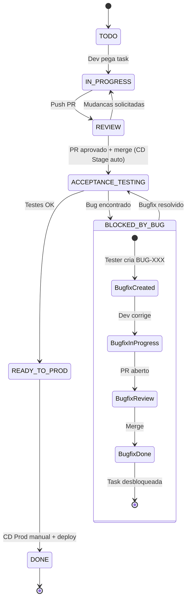

# GitFlow - BTC Grid Bot

**Data:** 26 de Dezembro de 2025
**Versao:** 1.3

---

## Sumario

1. [Visao Geral](#visao-geral)
2. [Ambientes](#ambientes)
3. [Diagrama do Fluxo](#diagrama-do-fluxo)
4. [Estados das Tasks](#estados-das-tasks)
5. [Fluxo Detalhado](#fluxo-detalhado)
6. [Fluxo de Deploy](#fluxo-de-deploy)
7. [Processo de Bugfix](#processo-de-bugfix)
8. [Convencoes de Nomenclatura](#convencoes-de-nomenclatura)
9. [Responsabilidades](#responsabilidades)
10. [Checklists por Etapa](#checklists-por-etapa)
11. [Templates de PR](#templates-de-pr)
12. [Criterios de Aprovacao](#criterios-de-aprovacao)
13. [Resolucao de Conflitos](#resolucao-de-conflitos)
14. [Rollback](#rollback)

---

## Visao Geral

Este documento define o fluxo de trabalho GitFlow para o projeto BTC Grid Bot. O fluxo e baseado em:

- **Branch principal:** `main` (codigo de producao)
- **PRs diretos para main:** Features, bugfixes e hotfixes
- **Dois ambientes:** Stage (demo) e Production (live)
- **Deploy automatico para Stage:** Via CD Stage + Watchtower
- **Deploy manual para Production:** Via CD Prod + Watchtower

---

## Ambientes

### Stage
- **Imagem:** `btcbot:stage`
- **Porta:** 3001
- **TRADING_MODE:** `demo` (sempre!)
- **Banco:** postgres-stage (separado)
- **Deploy:** Automatico apos merge em main
- **Proposito:** Testes de aceitacao antes de ir para producao

### Production
- **Imagem:** `btcbot:latest`
- **Porta:** 3000
- **TRADING_MODE:** `live`
- **Banco:** postgres-prod (separado)
- **Deploy:** Manual via workflow_dispatch
- **Proposito:** Ambiente real de trading

---

## Diagrama do Fluxo

### Fluxo Completo (ASCII)

```
+------------------+
|       TODO       |
+--------+---------+
         |
         | Dev pega task
         v
+------------------+
|   IN_PROGRESS    |
|                  |
|  - Cria branch   |
|  - Desenvolve    |
|  - Push PR       |
+--------+---------+
         |
         | Finaliza desenvolvimento
         v
+------------------+
|      REVIEW      |
|                  |
|  - Code Review   |
|  - Sugestoes     |
|  - Aprovacao     |
+--------+---------+
         |
         | PR aprovado, merge para main
         | CD Stage automatico -> btcbot:stage
         v
+------------------+
|ACCEPTANCE_TESTING|                    +--------------------+
|                  |                    |                    |
|  - Testes Stage  |     Bug?           | tasks_bugfixes.md  |
|  - Validacao     +-------------------->                    |
|  - port 3001     |     Tester cria    |  Nova task BUG-X   |
+--------+---------+     task de bugfix +--------+-----------+
         |                                       |
         |                              +--------v-----------+
         |                              |  BLOCKED_BY_BUG    |
         |                              |  (task original)   |
         |                              +--------+-----------+
         |                                       |
         | Sem bugs                              | Dev corrige bugfix
         |                                       | (mesmo fluxo)
         |                                       |
         |                              +--------v-----------+
         |                              | Bugfix DONE        |
         |                              | Task DESBLOQUEADA  |
         |                              +--------+-----------+
         |                                       |
         |<--------------------------------------+
         |       Tester retesta task original
         v
+------------------+
|  READY_TO_PROD   |
|                  |
|  - CD Prod manual|
|  - retag -> latest
+--------+---------+
         |
         | Deploy Production concluido
         | Watchtower atualiza btcbot-prod
         v
+------------------+
|       DONE       |
+------------------+
```

### Fluxo em Mermaid



### Fluxo de Branches

```
main ─────────────────────────────────────────────────────────────>
    \                                      /           \           /
     \  feature/BE-001-trade-repository   /             \ bugfix  /
      \_________________________________ /               \_______ /
                   PR + Review                           PR + Review
                        |                                     |
                        v                                     v
                   CD Stage auto                         CD Stage auto
                   btcbot:stage                          btcbot:stage
```

### Fluxo de Deploy

```
                    +------------------+
                    |   PR Merged      |
                    |   to main        |
                    +--------+---------+
                             |
                             v
                    +------------------+
                    | CD Stage (auto)  |
                    | Build + Push     |
                    | btcbot:stage     |
                    +--------+---------+
                             |
                             v
                    +------------------+
                    | Watchtower Stage |
                    | Auto-update      |
                    | port 3001        |
                    +--------+---------+
                             |
                             v
                    +------------------+
                    | Acceptance Test  |
                    | em Stage         |
                    +--------+---------+
                             |
              +--------------+--------------+
              |                             |
              v                             v
     +------------------+          +------------------+
     | OK - Aprovado    |          | Bug Encontrado   |
     +--------+---------+          +--------+---------+
              |                             |
              v                             v
     +------------------+          +------------------+
     | CD Prod (manual) |          | Tester cria task |
     | workflow_dispatch|          | em tasks_bugfix  |
     | Retag stage ->   |          +--------+---------+
     | latest           |                   |
     +--------+---------+                   v
              |                    +------------------+
              v                    | Dev corrige      |
     +------------------+          | (PR + Review)    |
     | Watchtower Prod  |          +--------+---------+
     | Auto-update      |                   |
     | port 3000        |                   v
     +------------------+          Volta para Acceptance
```

---

## Estados das Tasks

### Definicao dos Estados

| Estado | Descricao | Responsavel | Ambiente |
|--------|-----------|-------------|----------|
| `TODO` | Task disponivel para ser iniciada | - | - |
| `IN_PROGRESS` | Desenvolvimento em andamento | Dev | Local |
| `REVIEW` | Aguardando code review | Reviewer | - |
| `ACCEPTANCE_TESTING` | Em testes no ambiente Stage | Tester | Stage (:3001) |
| `BLOCKED_BY_BUG` | Aguardando correcao de bug(s) | Dev | Stage (:3001) |
| `READY_TO_PROD` | Aprovado, aguardando deploy producao | Dev | - |
| `DONE` | Concluido e em producao | - | Production (:3000) |

### Estado BLOCKED_BY_BUG

Este e um estado especial que indica que a task original esta **bloqueada** ate que todos os bugfixes relacionados sejam resolvidos.

**Quando uma task entra em BLOCKED_BY_BUG:**
- Tester encontrou bug durante Acceptance Testing
- Tester criou task de bugfix em `/tasks/tasks_bugfixes.md`
- Task original NAO pode avancar para READY_TO_PROD

**Quando uma task sai de BLOCKED_BY_BUG:**
- TODOS os bugfixes relacionados foram resolvidos (status DONE)
- Task volta para ACCEPTANCE_TESTING
- Tester retesta a task original
- Se OK, task avanca para READY_TO_PROD

### Transicoes Permitidas

```
TODO ──────────────> IN_PROGRESS
IN_PROGRESS ───────> REVIEW
REVIEW ────────────> IN_PROGRESS (mudancas solicitadas)
REVIEW ────────────> ACCEPTANCE_TESTING (aprovado + merge -> CD Stage)
ACCEPTANCE_TESTING ─> READY_TO_PROD (testes OK, sem bugs)
ACCEPTANCE_TESTING ─> BLOCKED_BY_BUG (bug encontrado -> criar em tasks_bugfixes.md)
BLOCKED_BY_BUG ────> ACCEPTANCE_TESTING (todos bugfixes resolvidos)
READY_TO_PROD ─────> DONE (CD Prod manual + deploy)
```

### Transicoes NAO Permitidas

- `REVIEW` -> `TODO` (nao pode voltar para TODO)
- `DONE` -> qualquer estado (task finalizada)
- `TODO` -> `REVIEW` (deve passar por IN_PROGRESS)
- `BLOCKED_BY_BUG` -> `READY_TO_PROD` (deve passar por ACCEPTANCE_TESTING)
- `BLOCKED_BY_BUG` -> `DONE` (deve passar por ACCEPTANCE_TESTING e READY_TO_PROD)
- Pular estados (ex: IN_PROGRESS -> DONE)

---

## Fluxo Detalhado

### 1. Inicio do Desenvolvimento

**Acoes:**
1. Dev seleciona uma task em `TODO`
2. Move a task para `IN_PROGRESS`
3. Cria branch a partir de `main`:
   ```bash
   git checkout main
   git pull origin main
   git checkout -b feature/BE-001-implementar-trade-repository
   ```
4. Inicia o desenvolvimento

**Regras:**
- Cada dev deve ter no maximo 1 task em `IN_PROGRESS`
- Branch deve seguir a convencao de nomenclatura
- Commits devem ser atomicos e descritivos

### 2. Desenvolvimento Concluido

**Acoes:**
1. Dev finaliza a implementacao
2. Garante que todos os testes passam localmente:
   ```bash
   pytest
   ruff check .
   mypy .
   ```
3. Faz push da branch:
   ```bash
   git push origin feature/BE-001-implementar-trade-repository
   ```
4. Abre PR para `main` usando o template apropriado
5. Move a task para `REVIEW`

**Regras:**
- PR deve ter descricao clara do que foi feito
- Todos os checks de CI devem passar
- PR deve referenciar a task (ex: `Closes #123` ou `Ref: BE-001`)

### 3. Code Review

> **Nota:** Para projetos com agentes de IA usando a mesma conta GitHub,
> usamos um fluxo de review via comentario + label (ver detalhes em [BRANCH_PROTECTION.md](/docs/BRANCH_PROTECTION.md)).

**Fluxo de Review com Agentes:**

```
1. Agente Implementador cria PR e adiciona label "needs-review"
2. Agente Revisor (mesma disciplina) e acionado
3. Agente Revisor analisa o codigo e deixa comentario de review
4. Se aprovado: adiciona label "approved"
5. Se mudancas necessarias: adiciona label "changes-requested"
6. Agente Implementador e notificado para fazer merge (se aprovado) ou ajustes
```

**Acoes do Agente Revisor:**
1. Analisa o codigo seguindo os criterios de aprovacao
2. Deixa comentario estruturado no PR com checklist
3. Adiciona label apropriado:
   - `approved` - PR pronto para merge
   - `changes-requested` - Precisa de ajustes
4. Se mudancas solicitadas, descreve o que precisa mudar

**Exemplo de Comentario de Review:**
```markdown
## Review por staff-devops agent

### Checklist
- [x] Codigo segue padroes do projeto
- [x] Sem problemas de seguranca
- [x] Testes adequados
- [x] Documentacao atualizada

### Resultado: APROVADO

O PR esta pronto para merge.
```

**Acoes do Agente Implementador (se mudancas solicitadas):**
1. Analisa cada ponto do review
2. Implementa as mudancas necessarias
3. Faz push das correcoes
4. Solicita nova revisao (remove label "changes-requested", adiciona "needs-review")

**Regras:**
- Revisor deve ser da mesma disciplina (DevOps revisa DevOps, Backend revisa Backend)
- Revisor NAO pode ser o mesmo agente que implementou
- Discussoes devem ser objetivas e construtivas
- Merge so apos label "approved" estar presente

### 4. Merge e Deploy para Stage

**Acoes:**
1. Dev faz merge do PR com `main`:
   ```bash
   # Via GitHub UI ou CLI
   gh pr merge --merge
   ```
2. **CD Stage e acionado automaticamente:**
   - Build da imagem Docker
   - Push para registry com tag `btcbot:stage`
3. **Watchtower detecta nova imagem** (poll 30s)
4. **Container btcbot-stage e atualizado automaticamente**
5. Dev move task para `ACCEPTANCE_TESTING`

**Regras:**
- Usar "Merge commit" (nao squash ou rebase)
- Deletar branch apos merge
- Verificar se CD Stage completou com sucesso
- Verificar se Watchtower atualizou o container

### 5. Acceptance Testing

**Acoes do Tester:**
1. Acessa ambiente Stage (porta 3001)
2. Usa descricao da task para saber o que testar
3. Executa testes manuais e/ou automatizados
4. Documenta resultados

**Se bugs forem encontrados:**
1. Tester cria nova task de bugfix em `/tasks/tasks_bugfixes.md`
2. Usa o template de bugfix do arquivo
3. Referencia a task original
4. **IMPORTANTE:** Tester move a task original para `BLOCKED_BY_BUG`
5. Dev pega a task de bugfix e segue o mesmo fluxo (branch -> PR -> review -> merge)
6. Apos merge do bugfix, Tester retesta em Stage
7. Se bugfix OK: move bugfix para DONE
8. Se todos bugfixes resolvidos: task original volta para `ACCEPTANCE_TESTING`
9. Tester retesta task original

**Se nenhum bug for encontrado:**
1. Tester move task para `READY_TO_PROD`

**Regras:**
- Todos os criterios de aceite devem ser verificados
- Bugs devem ser documentados em `/tasks/tasks_bugfixes.md`
- Task original fica BLOQUEADA ate todos os bugfixes serem resolvidos
- Bugfixes tem prioridade no code review

### 6. Ready to Production

**Acoes:**
1. Dev executa o workflow CD Prod manualmente:
   ```
   GitHub Actions -> CD Production -> Run workflow
   - stage_sha: (deixar vazio para usar stage:latest)
   - confirm: DEPLOY
   ```
2. CD Prod faz retag da imagem:
   - Pull `btcbot:stage`
   - Retag para `btcbot:latest`
   - Push `btcbot:latest`
3. Watchtower Prod detecta nova imagem
4. Container btcbot-prod e atualizado
5. Dev verifica healthcheck em producao (porta 3000)
6. Move task para `DONE`

**Regras:**
- Deploy para producao deve ser feito em horario apropriado
- Verificar que nao ha outras tasks em READY_TO_PROD conflitantes
- Comunicar time sobre deploy
- Validar que o bot esta funcionando corretamente

---

## Fluxo de Deploy

### Stage (Automatico)

```
PR merged to main
       |
       v
+------------------+
| GitHub Actions   |
| cd-stage.yml     |
+--------+---------+
         |
         | Build + Push
         v
+------------------+
| Docker Registry  |
| btcbot:stage     |
+--------+---------+
         |
         | Poll 30s
         v
+------------------+
| Watchtower       |
| Auto-update      |
+--------+---------+
         |
         v
+------------------+
| btcbot-stage     |
| port 3001        |
| TRADING=demo     |
+------------------+
```

### Production (Manual)

```
Tester aprova em Stage
       |
       v
+------------------+
| GitHub Actions   |
| cd-prod.yml      |
| (manual trigger) |
+--------+---------+
         |
         | Retag stage -> latest
         v
+------------------+
| Docker Registry  |
| btcbot:latest    |
+--------+---------+
         |
         | Poll 30s
         v
+------------------+
| Watchtower       |
| Auto-update      |
+--------+---------+
         |
         v
+------------------+
| btcbot-prod      |
| port 3000        |
| TRADING=live     |
+------------------+
```

---

## Processo de Bugfix

### Quando o Tester Encontra um Bug

1. **Documentar o Bug:**
   - Criar nova task em `/tasks/tasks_bugfixes.md`
   - Usar o template do arquivo
   - Incluir: descricao, passos para reproduzir, evidencias, severidade

2. **Bloquear Task Original:**
   - Mover task original para `BLOCKED_BY_BUG`
   - Referenciar o BUG-XXX na task original

3. **Formato do ID:** `BUG-XXX` (ex: BUG-001, BUG-002)

4. **Severidade:**
   - **Critica:** Sistema inutilizavel, perda de dados, afeta trading
   - **Alta:** Funcionalidade principal nao funciona
   - **Media:** Funcionalidade secundaria com problemas
   - **Baixa:** Problema estetico ou menor

### Fluxo do Bugfix

```
1. Tester cria BUG-001 em tasks_bugfixes.md
2. Tester move task original para BLOCKED_BY_BUG
3. Dev move BUG-001 para IN_PROGRESS
4. Dev cria branch: bugfix/BUG-001-fix-pnl-calculation
5. Dev corrige e abre PR
6. Reviewer faz code review
7. Merge -> CD Stage automatico
8. Tester retesta bugfix em Stage
9. Se OK: BUG-001 vai para DONE
10. Se todos bugfixes resolvidos: task original volta para ACCEPTANCE_TESTING
11. Tester retesta task original
12. Se OK: task original vai para READY_TO_PROD
```

### Diagrama de Bloqueio

```
+------------------+     Bug encontrado     +------------------+
|ACCEPTANCE_TESTING| ------------------->   |  BLOCKED_BY_BUG  |
|   (task BE-001)  |                        |   (task BE-001)  |
+------------------+                        +--------+---------+
                                                     |
                                                     | Aguarda bugfix
                                                     v
                                            +------------------+
                                            | tasks_bugfixes.md|
                                            |   BUG-001: ...   |
                                            +--------+---------+
                                                     |
                                                     | Dev corrige
                                                     v
                                            +------------------+
                                            | BUG-001 DONE     |
                                            +--------+---------+
                                                     |
                                                     | Todos bugs resolvidos
                                                     v
+------------------+     Tester retesta     +------------------+
|  READY_TO_PROD   | <-------------------   |ACCEPTANCE_TESTING|
|   (task BE-001)  |      Task OK           |   (task BE-001)  |
+------------------+                        +------------------+
```

### Branch de Bugfix

```bash
git checkout main
git pull origin main
git checkout -b bugfix/BUG-001-fix-pnl-calculation
```

### Arquivo tasks_bugfixes.md

Localizacao: `/tasks/tasks_bugfixes.md`

Este arquivo contem:
- Template para criar novos bugs
- Lista de bugs ativos
- Lista de bugs resolvidos
- Estatisticas de bugs
- SLA por severidade

---

## Convencoes de Nomenclatura

### Branches

| Tipo | Padrao | Exemplo |
|------|--------|---------|
| Feature | `feature/<TASK_ID>-<descricao>` | `feature/BE-001-implementar-trade-repository` |
| Bugfix | `bugfix/<BUG_ID>-<descricao>` | `bugfix/BUG-001-fix-pnl-calculation` |
| Hotfix | `hotfix/<TASK_ID>-<descricao>` | `hotfix/BE-001-corrigir-validacao` |

**Regras:**
- Usar lowercase
- Usar hifen para separar palavras
- Descricao deve ser curta (3-5 palavras)
- Sempre incluir o ID da task ou bug

### Commits

```
<tipo>(<escopo>): <descricao>

[corpo opcional]

[rodape opcional]
```

**Tipos:**
- `feat`: Nova funcionalidade
- `fix`: Correcao de bug
- `refactor`: Refatoracao sem mudanca de comportamento
- `test`: Adicao ou correcao de testes
- `docs`: Documentacao
- `chore`: Manutencao (deps, configs)

**Exemplos:**
```
feat(repository): implementar TradeRepository com asyncpg

fix(dashboard): corrigir calculo de PnL total

refactor(grid): extrair logica de niveis para classe separada

test(repository): adicionar testes de integracao

docs(gitflow): documentar processo de code review

chore(deps): atualizar asyncpg para 0.29.0
```

### Pull Requests

**Titulo:**
```
[<TASK_ID>] <Tipo>: <Descricao>
```

**Exemplos:**
```
[BE-001] Feature: Implementar TradeRepository
[BUG-001] Bugfix: Corrigir calculo de PnL
[BE-001] Hotfix: Corrigir validacao de trades
```

---

## Responsabilidades

### Dev (Desenvolvedor)

| Fase | Responsabilidades |
|------|-------------------|
| TODO | Selecionar task apropriada para suas habilidades |
| IN_PROGRESS | Implementar seguindo padroes, escrever testes, documentar |
| REVIEW | Responder comentarios, fazer ajustes solicitados |
| ACCEPTANCE_TESTING | Corrigir bugs encontrados (criar branch bugfix) |
| READY_TO_PROD | Executar CD Prod, verificar producao |

### Reviewer (Revisor de Codigo)

| Fase | Responsabilidades |
|------|-------------------|
| REVIEW | Analisar codigo, sugerir melhorias, aprovar ou rejeitar |
| Qualquer fase | Estar disponivel para tirar duvidas |

**Criterios para ser Reviewer:**
- Ser da mesma disciplina (backend, frontend, etc)
- Ter conhecimento do modulo sendo alterado
- Nao ser o autor do PR

### Tester (Testador)

| Fase | Responsabilidades |
|------|-------------------|
| ACCEPTANCE_TESTING | Testar em Stage, **criar bugs em tasks_bugfixes.md**, **bloquear task original**, aprovar para prod |
| Qualquer fase | Manter casos de teste atualizados |

**IMPORTANTE:** Quando encontrar bugs, o Tester deve:
1. Criar a task de bugfix em `/tasks/tasks_bugfixes.md`
2. Mover a task original para `BLOCKED_BY_BUG`

---

## Checklists por Etapa

### Checklist: Antes de Abrir PR

- [ ] Codigo compila sem erros
- [ ] Todos os testes passam (`pytest`)
- [ ] Lint passa (`ruff check .`)
- [ ] Type check passa (`mypy .`)
- [ ] Commits seguem convencao
- [ ] Branch esta atualizada com main
- [ ] Documentacao atualizada (se aplicavel)
- [ ] Arquivo `.env.*.example` atualizado (se novas variaveis)

### Checklist: Code Review

- [ ] Codigo e legivel e bem organizado
- [ ] Segue padroes do projeto
- [ ] Testes cobrem casos principais
- [ ] Nao ha codigo comentado ou debug
- [ ] Nao ha secrets ou credenciais
- [ ] Performance foi considerada
- [ ] Erros sao tratados adequadamente
- [ ] Logs sao uteis e nao excessivos

### Checklist: Antes do Merge

- [ ] Todos os checks de CI passaram
- [ ] PR foi aprovado por pelo menos 1 reviewer
- [ ] Todos os comentarios foram resolvidos
- [ ] Nao ha conflitos com main
- [ ] Titulo e descricao do PR estao corretos

### Checklist: Acceptance Testing

- [ ] Todos os criterios de aceite foram verificados
- [ ] Fluxos principais funcionam
- [ ] Casos de erro foram testados
- [ ] Performance esta aceitavel
- [ ] Logs mostram informacoes corretas
- [ ] Nao ha regressoes em funcionalidades existentes
- [ ] Testado em Stage (porta 3001, TRADING_MODE=demo)

### Checklist: Deploy para Producao

- [ ] Task esta em READY_TO_PROD
- [ ] Nenhum outro deploy em andamento
- [ ] Backup do banco de producao foi feito (se necessario)
- [ ] Time foi notificado sobre deploy
- [ ] Plano de rollback esta pronto
- [ ] Horario apropriado para deploy
- [ ] CD Prod executado com sucesso
- [ ] Watchtower atualizou btcbot-prod
- [ ] Healthcheck em producao (porta 3000) OK

---

## Templates de PR

### Template: Feature

```markdown
## [TASK_ID] Feature: Titulo

### Descricao
Breve descricao do que foi implementado.

### Task Relacionada
- Ref: TASK_ID (ex: BE-001)

### Mudancas
- [ ] Mudanca 1
- [ ] Mudanca 2
- [ ] Mudanca 3

### Como Testar
1. Passo 1
2. Passo 2
3. Passo 3

### Screenshots (se aplicavel)
[Imagens aqui]

### Checklist
- [ ] Testes adicionados/atualizados
- [ ] Documentacao atualizada
- [ ] Lint e type check passando
- [ ] PR atualizado com main

### Notas para Reviewer
Pontos de atencao ou decisoes de design.
```

### Template: Bugfix

```markdown
## [BUG_ID] Bugfix: Titulo

### Descricao do Bug
O que estava acontecendo de errado.

### Task de Bug
- Ref: BUG_ID (ex: BUG-001)
- Task original: TASK_ID (ex: BE-001)

### Causa Raiz
Por que o bug acontecia.

### Solucao
Como foi corrigido.

### Como Reproduzir (antes)
1. Passo 1
2. Passo 2
3. Bug aparece

### Como Testar (depois)
1. Passo 1
2. Passo 2
3. Bug nao aparece mais

### Checklist
- [ ] Teste de regressao adicionado
- [ ] Lint e type check passando
- [ ] PR atualizado com main
```

### Template: Hotfix

```markdown
## [TASK_ID] Hotfix: Titulo

### URGENTE: Descricao do Problema
Descricao do problema encontrado em Stage/Prod.

### Impacto
Qual o impacto do problema (usuarios afetados, dados, etc).

### Correcao
O que foi feito para corrigir.

### Task Relacionada
- Ref: TASK_ID
- Bug encontrado em: ACCEPTANCE_TESTING

### Testes Realizados
- [ ] Teste local
- [ ] Verificado que corrige o bug
- [ ] Verificado que nao causa regressao

### Checklist
- [ ] Correcao minima (sem mudancas extras)
- [ ] Lint e type check passando
- [ ] Pronto para merge urgente
```

---

## Criterios de Aprovacao

### Code Review - Criterios Obrigatorios

O PR deve ser **rejeitado** se:

1. **Funcionalidade incorreta**
   - Nao implementa o que foi pedido
   - Comportamento diferente do especificado

2. **Bugs obvios**
   - Erros de logica evidentes
   - Casos nao tratados

3. **Problemas de seguranca**
   - Secrets no codigo
   - Vulnerabilidades conhecidas
   - SQL injection, XSS, etc

4. **Quebra de testes**
   - Testes existentes falhando
   - Cobertura reduzida significativamente

5. **Problemas graves de performance**
   - Queries N+1
   - Loops infinitos
   - Memory leaks obvios

### Code Review - Criterios Opcionais

O PR pode ser aprovado **com sugestoes** para:

1. **Melhorias de legibilidade**
   - Nomes de variaveis
   - Estrutura do codigo
   - Comentarios

2. **Melhorias de performance minor**
   - Otimizacoes que nao sao criticas

3. **Refatoracoes futuras**
   - Sugestoes para melhorar em proxima iteracao

4. **Estilo de codigo**
   - Preferencias pessoais (se lint passar)

### Acceptance Testing - Criterios de Aprovacao

A task so pode ir para `READY_TO_PROD` se:

1. **Todos os criterios de aceite passam**
   - Cada item da lista foi verificado
   - Comportamento e o esperado

2. **Fluxo principal funciona**
   - Happy path completo
   - Sem erros ou excecoes

3. **Casos de erro sao tratados**
   - Mensagens de erro claras
   - Sistema nao quebra

4. **Sem regressoes**
   - Funcionalidades existentes continuam funcionando

### Acceptance Testing - Quando Reprovar

Reprovar, **criar task de bugfix em tasks_bugfixes.md** e **bloquear task original** se:

1. **Criterio de aceite nao atendido**
   - Funcionalidade incompleta
   - Comportamento incorreto

2. **Bug blocker**
   - Impede uso da funcionalidade
   - Causa perda de dados

3. **Bug critico**
   - Afeta outras funcionalidades
   - Experiencia do usuario comprometida

---

## Resolucao de Conflitos

### Conflitos de Merge

**Quando acontecem:**
- Outra pessoa alterou os mesmos arquivos
- Branch esta desatualizada em relacao a main

**Como resolver:**

1. Atualizar branch com main:
   ```bash
   git checkout feature/BE-001-trade-repository
   git fetch origin
   git rebase origin/main
   ```

2. Resolver conflitos arquivo por arquivo:
   ```bash
   # Editar arquivos conflitantes
   git add <arquivo>
   git rebase --continue
   ```

3. Forcar push (apenas na sua branch):
   ```bash
   git push origin feature/BE-001-trade-repository --force-with-lease
   ```

**Regras:**
- NUNCA fazer force push em main
- Preferir rebase sobre merge para manter historico limpo
- Em caso de duvida, pedir ajuda

### Conflitos de Code Review

**Quando Dev e Reviewer discordam:**

1. **Discussao no PR**
   - Dev explica sua decisao
   - Reviewer explica sua preocupacao
   - Ambos buscam entender o outro lado

2. **Escalacao (se necessario)**
   - Envolver um terceiro dev
   - Decisao por consenso ou maioria

3. **Documentar decisao**
   - Comentar no PR a decisao final
   - Justificar se for contra a sugestao

**Regras:**
- Foco no codigo, nao na pessoa
- Argumentos tecnicos, nao pessoais
- Prazo maximo de 24h para resolver

---

## Rollback

### Quando Fazer Rollback

Rollback imediato se:
- Producao esta fora do ar
- Perda de dados acontecendo
- Bug critico afetando todos usuarios

### Como Fazer Rollback em Stage

#### Opcao 1: Via Portainer
1. Acessar Portainer
2. Ir em Containers -> btcbot-stage
3. Clicar em Duplicate/Edit
4. Alterar tag da imagem para versao anterior (ex: `stage-abc1234`)
5. Deploy

### Como Fazer Rollback em Production

#### Opcao 1: Via Portainer (Mais Rapido)

1. Acessar Portainer
2. Ir em Images
3. Encontrar imagem anterior (por SHA ou tag)
4. Ir em Containers -> btcbot-prod
5. Clicar em Duplicate/Edit
6. Alterar tag da imagem para versao anterior
7. Deploy

#### Opcao 2: Via Git Revert

1. Identificar commit problematico:
   ```bash
   git log --oneline
   ```

2. Criar PR de revert:
   ```bash
   git checkout main
   git pull origin main
   git checkout -b revert/BE-001-problema
   git revert <commit-sha>
   git push origin revert/BE-001-problema
   ```

3. Abrir PR com label `URGENT`
4. Review rapido (pode ser self-approve em emergencia)
5. Merge -> CD Stage automatico
6. Testar em Stage
7. CD Prod manual para producao

#### Opcao 3: Via Re-tag Manual

1. Forcar deploy de tag anterior:
   ```bash
   # Re-tag da versao anterior como latest
   docker pull registry/btcbot:stage-abc1234
   docker tag registry/btcbot:stage-abc1234 registry/btcbot:latest
   docker push registry/btcbot:latest
   ```

2. Watchtower vai detectar e atualizar producao

### Apos Rollback

1. **Comunicar time**
   - O que aconteceu
   - O que foi feito
   - Proximos passos

2. **Investigar causa**
   - Por que o bug nao foi pego em Stage?
   - O que pode ser melhorado?

3. **Criar task de correcao**
   - Criar em tasks_bugfixes.md
   - Prioridade alta
   - Incluir testes para prevenir regressao

4. **Postmortem (se grave)**
   - Documentar timeline
   - Identificar melhorias no processo

---

## Referencias

- [Convencional Commits](https://www.conventionalcommits.org/)
- [GitHub Flow](https://docs.github.com/en/get-started/quickstart/github-flow)
- [Documentacao de Tarefas](/tasks/README.md)
- [Tasks de Bugfixes](/tasks/tasks_bugfixes.md)
- [Tasks de DevOps](/tasks/tasks_devops.md)

---

*Documento atualizado em 26/12/2025 - Versao 1.3 (Fluxo de review com agentes via comentario + label)*
